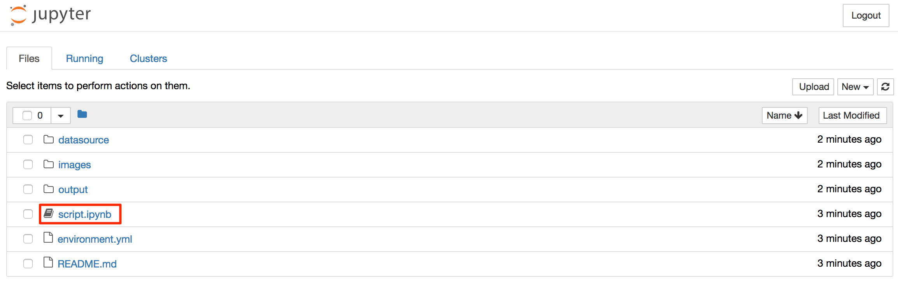
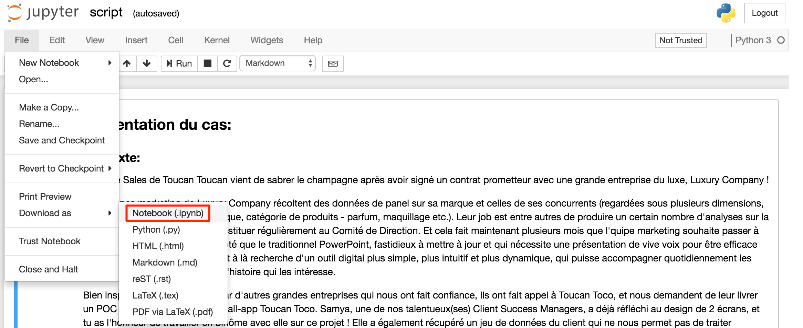
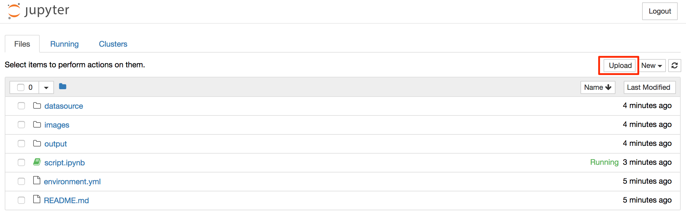

# Toucan Toco - Case Study - Data Analyst intern

Ce repository contient l'ensemble des matériaux nécessaires pour réaliser le cas pratique pour le stage de Data Analyst de Toucan Toco.

Pour réaliser ce cas technique, tu dois suivre les étapes suivantes:

### 1. Accès à l'environnement de travail

Pour démarrer ton travail, tu peux cliquer sur le bouton suivant : 
. Il t'amènera vers une plateforme qui met à ta disposition tout l'environnement nécessaire pour travailler (ne t'inquiète pas, le chargement peut durer un certain temps car Binder doit installer l'environnement). L'environnement inclut une installation de python 3 et de ses librairies standard, ainsi que les librairies numpy et pandas qui te suffiront à répondre au besoin de ce cas.

Il se peut que tu rencontres des problèmes avec l'environnement Binder, dans ce cas tu peux toujours télécharger les différents éléments et travailler en local sur ton ordinateur. Si tu rencontres des soucis n'hésite pas à nous contacter.

### 2. Ouverture du fichier "script.ipynb"

Une fois le chargement de l'environnement Binder terminé, tu arrives sur une page Jupyter où tu retrouves la liste des dossiers et fichiers de ce repository.
Tu peux cliquer sur le fichier "script.ipynb" comme montré ci-dessous:

Toutes les consignes du cas sont disponibles dans ce notebook et tu peux directement coder dans ce dernier !

> **ATTENTION: Binder est un environnement "jetable", c'est-à-dire que si tu quittes Binder sans avoir téléchargé ton notebook, ton travail est perdu. Nous te conseillons de garder ta session Binder ouverte jusqu'à ce que ton travail soit terminé, et de prendre la précaution de télécharger ton notebook régulièrement pour sauvegarder ton travail. Pour cela tu peux suivre la procédure décrite à l'étape 3.**

Si jamais tu as été forcé de quitter Binder et que tu souhaites rouvrir une session pour reprendre ton travail (à condition que tu aies bien une sauvegarde de ton notebook), tu peux refaire l'étape 1 et suivre la procédure décrite à l'étape 3.bis.

### 3. Téléchargement du notebook sur ton ordinateur

Pour cela il te suffit de clicker sur "File" > "Download as" > "Notebook" comme montré ci-dessous:

### 3bis. Ouvrir un notebook enregistré sur ton ordinateur dans Binder

Une fois sur la page d'accueil de Jupyter dans Binder (suite à l'étape 1), tu peux ouvrir un notebook venant de ton ordinateur en cliquant sur "Upload" en haut à droite de l'écran, comme montré ci-dessous sur l'image ci-dessous. Tu seras invité à aller chercher le notebook sur ton ordinateur. Si tu as gardé le même nom de fichier que celui déjà présent par défaut, on te demandera si tu souhaites bien écraser le fichier. Tu peux confirmer.

### 4. Quand tu as terminé ton travail et que tu souhaites nous le soumettre

Quand tu as fini, il faut que tu télécharges le notebook final comme décrit à l'étape 3.
Tu peux ensuite nous l'envoyer à l'adresse yanni.iyeze@toucantoco.com

Bon courage et n'hésite pas à nous contacter si tu as des questions.
